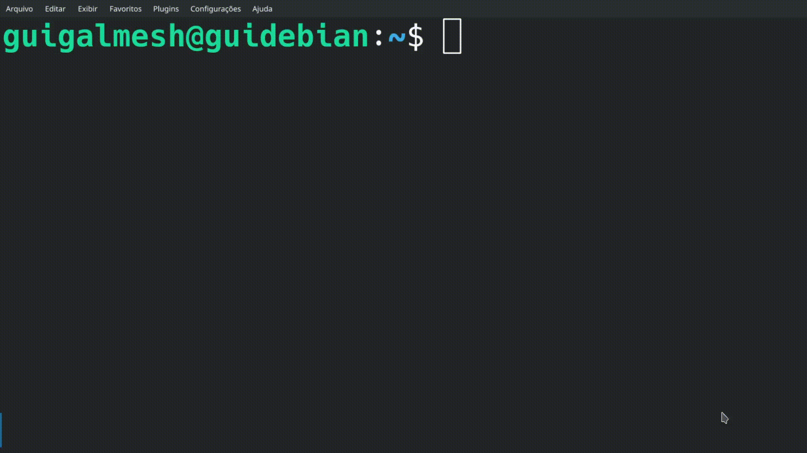

# Compiladores VS. Interpretadores
### Compiladores

Um **Compilador** é um software que lê um código escrito em uma linguagem, o código fonte, e o traduz para um código equivalente em uma outra linguagem alvo.

Esse processo pode ser dividido em duas grandes etapas:
* **Análise:** O compilador lê o código fonte, gera dados e os armazena numa "Tabela de Símbolos", e verifica se foi escrito corretamente. A análise também é chamada de **front-end**.
* **Síntese:** Usa os dados armazenados na Tabela de Símbolos para produzir um código equivalente na linguagem alvo (assembly, machine code, byte code). A síntese também é chamada de **back-end**.

As etapas de compilação podem ser divididas em:

##### 1. Análise / Front-end
Subdivide o programa em partes, analisa estas partes à procura de erros e gera uma representação intermediária. O front-end da compilação é dividido nas seguintes etapas:

* **Análise Léxica e Sintática:** Essas duas verificam se as palavras e a gramática do código estão corretas.
* **Análise Semântica:** Confere se o código faz sentido lógico (por exemplo, se você não está tentando somar um número com uma string).
* **Gerador de Código Intermediário:** Esse gerador transforma o código em uma Representação Intermediária (IR).

##### 2. Síntese / Back-end
Gera o código alvo a partir da representação intermediária. O back-end é dividido em três etapas:

1.  Otimizador de Código Independente de Máquina
2.  Gerador de Código
3.  Otimizador de Código Dependente de Máquina

#### Exemplos Clássicos

**Linguagens Compiladas:**
* C, C++, Rust, Go, Swift, Pascal, Delphi

**Compiladores:**
* GCC, Clang, Microsoft Visual C++, Turbo C

---

### Interpretadores

Enquanto o compilador faz todo o trabalho de tradução antes do programa rodar, gerando um executável, o **interpretador** atua "ao vivo", analisando e executando o código passo a passo.

Um interpretador puro possui fases de análise muito semelhantes às do compilador (como a análise léxica e sintática), mas a grande diferença é que, em vez de gerar um código de máquina final, ele executa as instruções imediatamente.

Muitas das linguagens modernas que chamamos de interpretadas usam, na verdade, um modelo híbrido.

Resumidamente, o interpretador lê a representação intermediária criada e otimizada pelo compilador, chamados de *byte code* (`.pyc`, `.class`), que são comandos que a máquina virtual da linguagem vai entender e então traduzir para a linguagem de máquina do computador.

As linguagens que adotam esse modelo híbrido precisam rodar em uma máquina virtual:
* **Java:** roda na Java Virtual Machine (JVM);
* **Python:** roda na Python Virtual Machine (PVM);
* **Javascript:** roda em uma máquina virtual contida no navegador (V8 para navegadores baseados em Chromium, SpiderMonkey no Firefox e JavaScriptCore no Safari).

### Compiladas VS. Intepretadas

| Característica | Compiladas | Interpretadas |
| :--- | :--- | :--- |
| **Desempenho na Execução** | Alto (código nativo da máquina) | Menor (tradução em tempo real) |
| **Portabilidade** | Baixa (depende do SO e processador) | Alta (roda onde o interpretador/VM estiver) |
| **Facilidade de Depuração** | Menor (exige recompilar a cada teste) | Maior (erros apontados linha a linha na hora) |
| **Tempo de Tradução Prévia** | Lento (analisa todo o projeto antes) | Inexistente (ou muito rápido na geração do bytecode) |
| **Ocultação do Código** | Alta (entrega apenas o binário executável) | Baixa (entrega o código-fonte ou bytecode) |
| **Dependência para Rodar** | Nenhuma (o sistema operacional roda direto) | Exige o interpretador ou VM instalados na máquina |

### REPL
Uma das maiores vantagens das linguagens interpretadas é a possibilidade de interagir com o código em tempo real. Um *interpretador interativo* que opera na linha de comando, também conhecido como REPL, nos permite explorar isso.

REPL significa Read-Evaluate-Print Loop, "Laço de Ler, Avaliar e Imprimir", ele recebe comandos do usuário, os executa e retorna os resultados. É muito útil para coisas como depuração ou testes enquanto o programa está rodando.
Um exemplo de uso de REPL através do GHCi do Haskell, onde eu testo algumas operações, funções, e crio minha própria função, tudo através da CLI.

